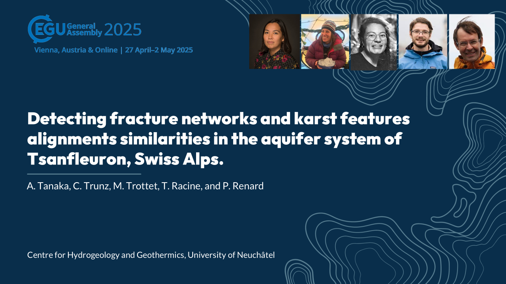

 

<h2>"Detecting fracture networks and karst features alignments similarities in the aquifer system of Tsanfleuron, Swiss Alps" </h2>
A.P.B. Tanaka, C. Trunz, M. Trottet, T. Racine, and P. Renard

[doi](https://doi.org/10.5194/egusphere-egu25-11154)
 
 

 

## Location 🌍
[Google Earth View](https://earth.google.com/web/@46.34152241,7.15320433,1500.43728679a,57903.53216515d,30y,0h,0t,0r/data=CgRCAggBMikKJwolCiExVDM0Z09CS1JkbDJFSFhhZEl3Nlh0SncxdnFjeGpwNC0gAToDCgEwQgIIAEoHCMrnjHAQAQ)
 
 

## References 📚
- DEIKE, G. (1989) Fracture controls on conduit development. Springer US, Boston, MA. 259–291.

- GREMAUD, V. (2008) Géologie du karst de Tsanfleuron. Collection EDYTEM. Cahiers de géographie 7:127–134.

- GREMAUD, V., GOLDSCHEIDER, N., SAVOY, L., FAVRE, G., MASSON, H. (2009) Geological structure, recharge processes and underground drainage of a glacierised karst aquifer system, tsanfleuron-sanetsch, swiss alps. Hydrogeology, 17:1833-1848

- KIRALY (1967) Relations entre les phénomènes karstiques et la géologie. Actes du 3e Congrès national de spéléologie. Société Suisse de Spéléologie. Supplément 3 à Stalactite: 31-43.

- KIRALY, L., MATHEY, B., TRIPET, J. (1971) Fissuration et orientation des cavités souterraines région de la grotte de Milandre (Jura tabulaire). Bulletin de la société neuchateloise des sciences naturelles. 94: 99-114.

- RABELO, J., MAIA, R., BEZERRA, F., SILVA, C. (2020) Karstification and fluid flow in carbonate units controlled by propagation and linkage of mesoscale fractures, Jandaíra Formation, Brazil. Geomorphology 357.

- SANDERSON, D. J., & PEACOCK, D. C. (2020). Making rose diagrams fit-for-purpose. Earth-Science Reviews, 201, 103055.

- TANAKA, A.P.B., RENARD, P., CALDEIRA, J.N.M., LIANG, X.X., TRUNZ, C., STRAUBHAAR, J. (2024) Graph-based modeling of fractures in the Tsanfleuron karst aquifer system. In: International Association of Hydrogeologists 2024 World water groundwater congress. 
 
 

### Acknowledgements 🙏
The authors acknowledge the speleology groups of GSR (Groupe de Spéléologie Rhodanien), SSG (Société Spéléologique Genevoise), SCJ (Spéléo-Club Jura), and GSL (Groupe Spéléo Lausanne) for sharing the karst surveys. Thanks, Jefter Natan de Moraes Caldeira for the field work, and discussions about structural geology. Thanks also to Eva Kaminsky for giving suggestions to improve the analyses. Thanks Nina Egli, Robin Voland, and Alex Kobayashi. P. Renard, C. Trunz and T. Racine acknowledge funding by the European Union (ERC, KARST, 101071836). Views and opinions expressed are however those of the authors only and do not necessarily reflect those of the European Union or the European Research Council Executive Agency. Neither the European Union nor the granting authority can be held responsible for them.
 
 

### Contact 📧
ana.burgoa@unine.ch
 
 

### Slide template 
[Slidesgo](https://slidesgo.com/)
