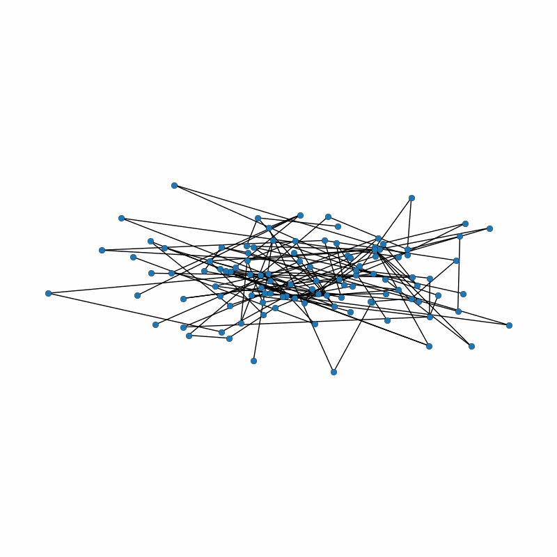

 

<h2>"Graph-based modelling of fractures in the Tsanfleuron karstic aquifer system" </h2>

A.P.B. Tanaka 1, P. Renard1, J.N.M. Caldeira2, C.Trunz1, X.X.Liang3, J.Straubhaar1

1  Centre for Hydrogeology and Geothermics, University of Neuchâtel, Neuchâtel, Switzerland  
2  Institute of Earth Science, University of Lausanne, Lausanne, Switzerland
3  National Institute of Scientific Research, Quebec, Canada

 

### Subgraph simulation 💻
An example of subgraph simulation using Graph Recurrent Neural Netwroks and Denoising Diffusion Probabilistic Models.

Method proposed by Straubhaar et al. 2024. Applied in this work with subgraphs from the Tsanfleuron fracture network:
 
 

 
 

## References 📚
- Ashlock, D., Smucker, M., Walker, J. 1999. Graph based genetic algorithms, in: Proceedings of the 1999 Congress331 on Evolutionary Computation-CEC99 (Cat. No. 99TH8406), IEEE. pp. 1362–1368.   
- Barabási-Albert. Emergence of scaling in random networks. science 286, 509–512. 
- Brandes, U. 2008. On variants of shortest-path betweenness centrality and their generic computation. Social Networks. 30, 136–145. 
- Bui, T.N., Moon, B.R., 1996. Genetic algorithm and graph partitioning. IEEE Transactions on computers 45, 841–855. 
- Gremaud, V., Goldscheider, N., Savoy, L., Favre, G., & Masson, H., 2009. Geological structure, recharge processes and underground drainage of a glacierised karst aquifer system, 	Tsanfleuron-Sanetsch, Swiss Alps. Hydrogeology journal. 17, 8, 1833-1848. 
- Gremaud, V. 2008. Géologie du karst de Tsanfleuron. Collection EDYTEM. Cahiers de géographie, 7(1), 127-134. 
- Goldberg, D.E., 2002. Genetic Algorithms and Innovation. Springer. pp. 1–9. 
- Google Earth. 2023. Map includes data from: Airbus, Landsat / Copernicus, Maxar Technologies, CNES / Airbus, Data SIO, NOAA, U.S. Navy, NGA, GEBCO. Imagery from the dates: 1/1/1997–newer. 
- Ho, J., Jain, A., Abbeel, P. 2020. Denoising diffusion probabilistic models.11239. 
- Martin, S. et Reynard, E. 2009. How can a complex geotourist map be made more effective ? : popularisation of the Tsanfleuron heritage (Valais, Switzerland). In Proceedings of the European Congress on Regional Geoscientific Cartography and Information Systems. Earth and Man. : Bayerisches Landesamt für Umwelt. 261-264. 
- Neven, A., Dall'Alba, V., Juda, P., Straubhaar, J. & Renard, P. 2021. Ice volume and basal topography estimation using geostatistical methods and ground-penetrating radar measurements: application to the Tsanfleuron and Scex Rouge glaciers, Swiss Alps. The Cryosphere. 15, 11, 5169-5186. 
- Nichol, A. Q., & Dhariwal, P. 2021. Improved denoising diffusion probabilistic models. In International conference on machine learning. PMLR. 8162-8171. 
- Sanderson, D.J., Peacock, D.C., Nixon, C.W., Rotevatn, A. 2019. Graph theory and the analysis of fracture networks. Journal of Structural Geology. 125, 155–165. 
- Straubhaar, J., Lauzon, D., & Renard, P. 2024. Graph recurrent neural networks for stochastic simulation of Karst network topology and properties. 
Switzerland Federal Office of Topography (swisstopo). 2011. Digital elevation model swissALTI3D. Switzerland Federal Office of Topography. 
- Tanaka, A.P.B., Renard, P., Straubhaar, J., Lauzon, D., 2024. Modeling fracture networks as graphs. In: Geostats2024. Ponta Delgada, Azores, Portugal. 199. 
- You, J., Ying, R., Ren, X., Hamilton, W., Leskovec, J., 2018. GraphRNN: Generating realistic graphs with deep auto-regressive models, in: International conference on machine learning. 
 
 

### Acknowledgements 🙏
Robin Voland, Dany Lauzon, Tanguy Racine, Alex Kobayashi, Margot Dupuis, Arnaud de Prarochet.
